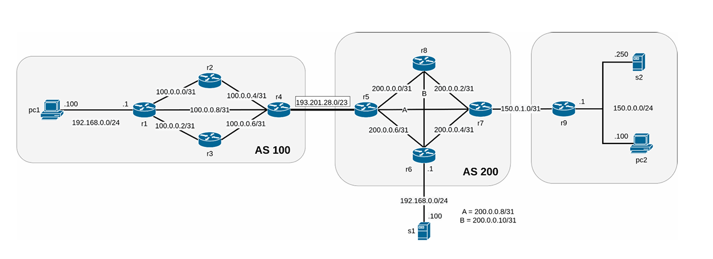

# Network-Infrastructures-Homework-A.A.-2024-2025
This repository contains the complete solution to the *Network Infrastructures* homework assigned for the 2024/2025 academic year. The lab was implemented using **Kathará**, a network emulation environment based on Linux containers.

**All tasks were completed successfully, earning full marks (18/18).**



## Structure

The lab is organized according to Kathará's requirements, with the following components:
- `lab.conf` – Network topology configuration
- `pc1/`, `pc2/`, `r1/`, ..., `r9/`, `s1/`, `s2/` – Node directories with startup configuration and scripts
- `shared/` – Shared folder used for PCAP captures and VPN certificates
- `commands.txt` – Contains the SSH port forwarding command (see task 13)

## Technologies and Protocols
The lab involves a complete emulated network with the following technologies:

- **Static IP assignment** via `/etc/network/interfaces`
- **OSPF** routing configuration (routers r6, r7, r8, r9)
- **Static routing** (routers r1, r2, r3)
- **BGP peering** between r4 and r5
  - AS100 announces `100.0.0.0/24`
  - AS200 announces `200.0.0.0/24` and `150.0.0.0/16`
- **NAT** and **firewall rules** on r1 and r6
- **Fine-grained firewalling** (including port-based restrictions and client-initiated traffic allowance)
- **SSH server** on `s2` with pubkey authentication
- **PKI setup**:
  - Certificate Authority (CA) using student's matricola as CN
  - Certificates for VPN server and two clients
- **OpenVPN**:
  - Server on `s1`, clients on `pc1` and `pc2`
  - VPN over TCP, port 7000, subnet `10.0.0.0/24`
  - Client-to-client communication enabled
- **SSH port forwarding** from `pc1` via `s2` to restore VPN access under restricted conditions
- **Traffic generation** and **packet capture** (`.pcap` files)

## Notable Files
- `shared/capture_1.pcap` – Packet capture of VPN traffic from pc1 to pc2 (pre-firewall restriction)
- `shared/capture_2.pcap` – VPN traffic capture using SSH port forwarding (post-firewall restriction)
- `commands.txt` – Contains SSH port forwarding command used in task 13

## How to Run

1. Ensure you have [Kathará](https://github.com/KatharaFramework/Kathara) installed
2. From the root of the lab:
   ```bash
   kathara lstart
   ```
3. VPN and traffic generation steps are **not automated at startup**; refer to the homework PDF or inline comments to replicate them manually
